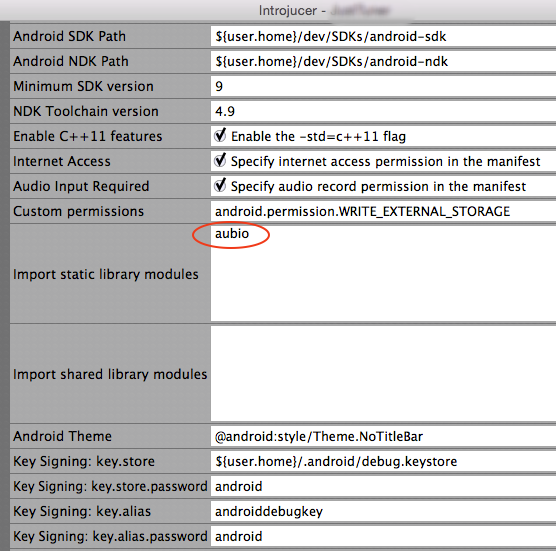

# aubio-android
Android NDK module for [Aubio](http://aubio.org)

Includes precompiled static libraries for arm and arm-v7, built with NDK 9. 

(See build-scripts for examples of building Aubio for android)

Important: Set your NDK_MODULE_PATH with 
```bash
export NDK_MODULE_PATH=<path-to-modules>/aubio-android
```
add this to your .bashrc or .zshrc

## JUCE instructions 

If you are using the [JUCE](http://www.juce.com) framework (latest tip as of 30/03/2015), you can just add ```aubio``` to the "Import static library modules" field in the Android config section in Introjucer.



## General instructions 
(If you are not using JUCE or the latest tip)

Make sure your main Android.mk file has 

```make
LOCAL_STATIC_LIBRARIES += aubio
```
and, at the very end
```make
$(call import-module, aubio)
```
